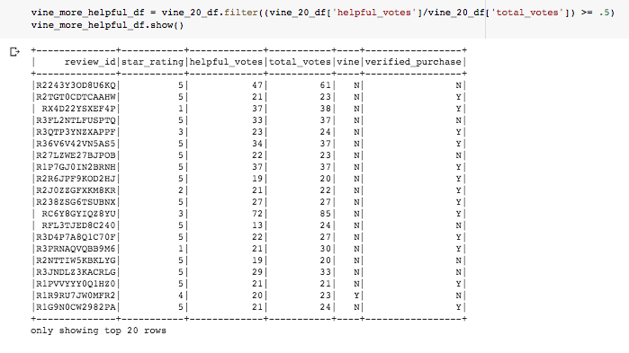

# Amazon_Vine_Analysis

## Project Overview

The purpose of this analysis was to use google colaboratory with PySpark aid a company called "Sellby" in determining if an amazon product reviewer's membership in the Amazon Vine program influences the likelihood that a product reviewer will give a five star rating to the product.  The Amazon Vine Program is a service that allows manufacturers and publishers to pay a fee in order to send a free product to a vine member who is then required to review the product on Amazon.  In order to perform this analysis, a dataset of reviews was extracted using PySpark from an S3 data storage bucket on Amazon for the category of musical instruments and saved in a dataframe.  Following this, the dataframe was transformed to include only the relevant columns for review_id, star_rating, helpful_votes, total_votes, vine, and verified_purchase.  The description of each of these columns is provided in the sources link below.  Finally, a series of filtering and calculation processes were performed to analyze the five-star ratings of "paid" vs "unpaid" reviews.  The results are listed and described below.

---------------------------------------------
## Resources:

Data Sources: 

    https://s3.amazonaws.com/amazon-reviews-pds/tsv/index.txt

Software: 

    Google Colaboratory
    PySpark
    Visual Studio Code 1.49.2

## Analysis Transformation

To conduct the analysis, a conglomeration of dataframe filtering procedures were performed in a google colab notebook after installing Pyspark, setting up a SparkSession, and extracting the data.  To begin, the raw dataframe of all reviews for musical instruments was filtered to only include the most relevant columns for the vine table as seen in the image below.

Using this vine table, the "total_votes" column was filtered to only include reviews which had at least twenty votes.  On Amazon's webiste, (at the time of writing this report) the way total votes are counted is the combination of instances where amazon customers vote either "up" (seen as a "helpful" button) or "down" (seen as a "report abuse" button) on a particular product review.  By only including rows with at least twenty votes, we avoid less impactful reviews as well as the possibility of having "division by zero" errors in upcoming calculations.

Next, we to retrieved all the rows where the number of helpful_votes divided by total_votes is equal to or greater than 50%.  This ensures our data only includes relatively insightful reviews according to customers.

With this dataframe, we then filtered two new dataframes.  The first table only included reviews from customers who are "vine voices" meaning they had received a free product as incentive to provide a review for the seller who paid amazon for setting up this customer-seller relationship.  The second table, was filtered for reviews from "non-vine voices".  Both are viewed below, respectively.

-Vine Voice Review (seller did pay for review incentive)

-Non-Vine Voice Review (seller did not pay for review incentive):

Following the dataframe tranformations, useful calculations were more accesible for analyzing the potential existence of bias toward favorable reviews due to incentivization from the amazon vine program.

## Results
From the analysis, the following bulleted list of questions were addressed:

* How many Vine reviews and non-Vine reviews were there?

    - As seen in the following image, the vine-incentivized reviews totaled 60 whereas other reviews totaled 14,477.

        

* How many Vine reviews were 5 stars? How many non-Vine reviews were 5 stars?

    -   There were 34 vine reviews with 5-star ratings and 8,212 total 5-star reviews from all other reviewers.

        

* What percentage of Vine reviews were 5 stars? What percentage of non-Vine reviews were 5 stars?

    - Finally, by dividing the 5-star reviews by the total reviews for each category, we find that the percentage of 5-star reviews was just over 56% on both "paid" amazon vine program members and non-paid "regular" reviewers.

    

# Summary

As seen from the analysis results, the membership vs nonmembership of the Amazon Vine program appears to show no significant influence on the percentage of 5-star reviews a product is likely to recieve.  Of course, this analysis has limitations as it only applies to this particular set of musical instrument reviews and it may or may not be representative of other product review categories.  As such, it may be advisable to test other categories as well.  Also, it may be advisable to also consider comparing other star-ratings than just 5-stars.

An additional analysis that may be useful with this dataset could be to conduct a similar transformation and calculation process to determine if the "verified puchase" status of the product review has any influence on the rating of a product.  Of course, this would exclude all vine voice reviewers in the analysis but it could help "Sellby", our client, analyze whether a review is affected if the person writing the review purchased the product at Amazon without any deep discount.